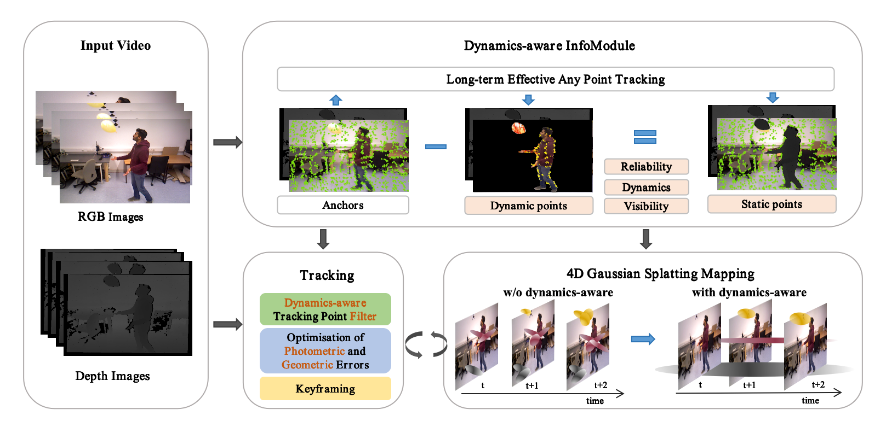

<p align="center">
  <h1 align="center">Embracing Dynamics: Dynamics-aware 4D Gaussian Splatting SLAM</h1>
</p>
<h3 align="center">IROS 2025</h3>


<!-- ### [Paper](https://arxiv.org/abs/2504.04844) | [Project Page](https://zhicongsun.github.io/d4dgs)--> 
  <p align="center">
    <a href=""><strong>Zhicong Sun</strong></a>
    ,
    <a href=""><strong>Jinxing Hu*</strong></a>
    ,
    <a href=""><strong>Jacqueline Lo*</strong></a>
  </p>
  <p align="center">(* Corresponding Authors)</p>
  

[comment]: <> (  <h2 align="center">PAPER</h2>)
  <h3 align="center"><a href="https://arxiv.org/abs/2504.04844">Paper</a> | <a href="https://zhicongsun.github.io/d4dgs">Project Page</a></h3>
  <div align="center"></div>

<br>
<p align="center">
  <a href="">
    
  </a>
</p>
<p align="center">Overview of our D4DGS-SLAM.
</p>
<br>


# Note
- The code will be publicly released soon. Please stay tuned for this exciting work. Thank you for your attention.


## TODO list
- [x] release the arxiv link
- [x] release the website
- [ ] release the full README file
- [ ] release the code of the 4d-gaussian-rasterization for 4DGS-based SLAM
- [ ] release the full code of our D4DGS-SLAM
- [ ] release the code of the evaluation

# Acknowledgement
This work incorporates many open-source codes. We extend our gratitude to the authors of the software.
- [3D Gaussian Splatting](https://github.com/graphdeco-inria/gaussian-splatting)
- [Differential Gaussian Rasterization
](https://github.com/graphdeco-inria/diff-gaussian-rasterization)
- [3D Gaussian Splatting](https://github.com/graphdeco-inria/gaussian-splatting)
- [Differential Gaussian Rasterization
](https://github.com/graphdeco-inria/diff-gaussian-rasterization)
- [4D Gaussian Splatting](https://github.com/fudan-zvg/4d-gaussian-splatting)
- [Gaussian Splatting SLAM](https://github.com/muskie82/MonoGS)
- [LEAP-VO](https://github.com/chiaki530/leapvo)
- [SplaTAM](https://github.com/spla-tam/SplaTAM)


# License
D4DGS-SLAM is released under a **LICENSE.md**. 

## Citation

If you find our paper and code useful, please cite us:

```bib
@inproceedings{sun2025d4dgsslam,
        title={Embracing Dynamics: Dynamics-aware 4D Gaussian Splatting SLAM},
        author={Zhicong Sun, Jacqueline Lo, Jinxing Hu},
        journal={arXiv preprint arXiv:2504.04844},
        year={2025}
}
```

